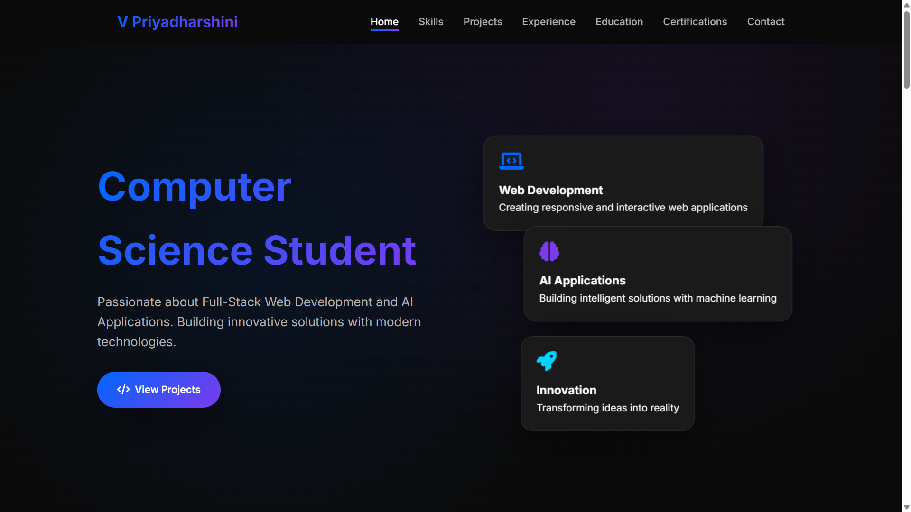
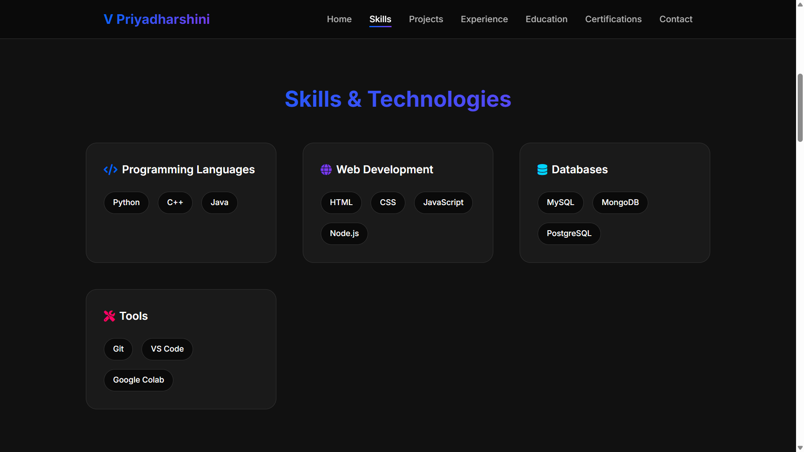
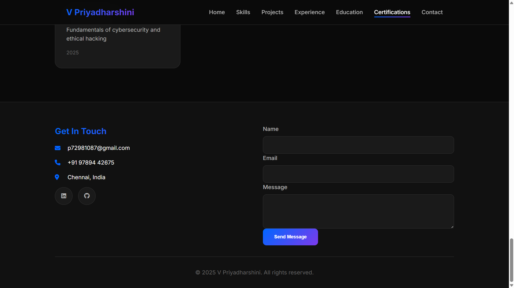

# 💼 Personal Portfolio Website  

> 🌐 A modern and responsive portfolio website built to showcase my projects, skills, and achievements in web development.

---
## 🚀 Live Demo

🔗 [Deployed in Vercel too!](https://vpriyaportfolio.vercel.app/)

---

## 🪄 Overview  
This project is my personal portfolio website designed to highlight my **technical skills, projects, and experience** in an elegant and user-friendly interface. It includes interactive UI components, smooth animations, and responsive design for all devices.

---

## ✨ Features  
- 🧭 **Home, About, Projects, Skills, and Contact** sections  
- 💡 **Responsive Design** for all screen sizes  
- 🖼️ **Dynamic Project Showcase**  
- 📬 **Contact Form** integrated with EmailJS (or backend API)  
- ⚡ **Smooth Scrolling & Animations** using modern CSS and JS  

---

## 🧰 Tech Stack  

| Category | Technologies |
|-----------|---------------|
| **Frontend** | HTML, CSS, JavaScript |
| **Deployment** | GitHub Pages |
| **Version Control** | Git & GitHub |

---

## 🖼️ Demo  
<details>
  <summary>📸 Click to view screenshots</summary>

  
  
  
</details>

---

## 🚀 Getting Started  

### Clone the Repository  
```bash
git clone https://github.com/VPriya100code/Portfolio.git
cd portfolio
